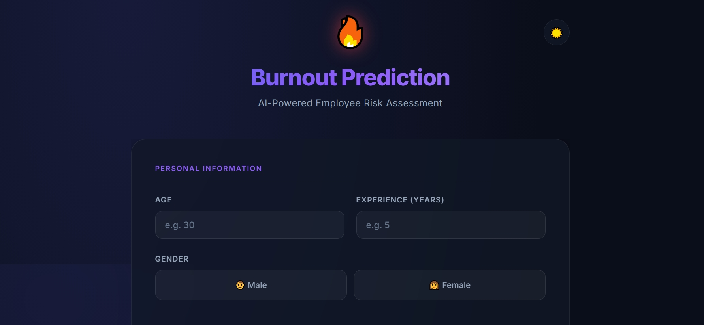

# 🔥 BurnoutGuard AI - Advanced Wellness Dashboard

> **Empowering professional well-being through Data Science.**

[](https://www.python.org/)
[](https://flask.palletsprojects.com/)
[](https://scikit-learn.org/)
[](https://web.dev/progressive-web-apps/)
[](http://Solvex.pythonanywhere.com)

**BurnoutGuard AI** is a premium, glassmorphic wellness dashboard that leverages **Machine Learning** to help professionals detect, track, and manage workplace stress. It combines scientific analysis with immediate mental health tools.



---

## 🚀 Key Features

### 🧠 Pure Machine Learning Assessment
*   **Logistic Regression Engine**: 100% model-driven predictions powered by `burnout_model5.pkl`.
*   **Factor Breakdown**: Detailed impact analysis of Stress Level, Work Hours, and Job Satisfaction.
*   **30-Day Action Plan**: A tailored roadmap to improve resilience and productivity.

### 🌟 Advanced Integrated Tools
*   **📊 Industry Benchmarks**: Compare your risk score against averages for Engineers, Managers, Analysts, etc.
*   **✨ Breathing Exercise**: Built-in guided **4-7-8 breathing module** for immediate relief.
*   **😊 Mood Tracking**: 30-day interactive mood heatmap and journaling.
*   **🎉 Gamification**: Unlock 6 unique Wellness Badges as you improve.

---

## 🛠️ Installation & Usage

### 1. Prerequisites
- Python 3.12+
- `pip` (Python package manager)

### 2. Local Setup
```bash
# Clone the repository
git clone https://github.com/iamsamahaziz/BurnoutTracker.git
cd BurnoutTracker

# Create a virtual environment
python -m venv venv
source venv/bin/activate  # Windows: venv\\Scripts\\activate

# Install dependencies
pip install -r requirements.txt
```

### 3. Run the Application
```bash
python app.py
```
Access the dashboard at `http://localhost:5000`.

---

## 📦 Project Structure
```markdown
BurnoutTracker/
├── app.py                # Flask application core
├── burnout_model5.pkl    # Trained ML Model
├── scaler5.pkl           # Data scaler for features
├── static/               # Assets & Styles
├── templates/            # HTML Dashboards
└── history.json          # Local assessment logs
```

---

## 🛡️ Privacy & Reliability
- **Local Data**: All history and mood logs are stored locally (server-side JSON).
- **Model Integrity**: Uses standard Logistic Regression with high accuracy benchmarks.

---
Created by **Samah AZIZ**
